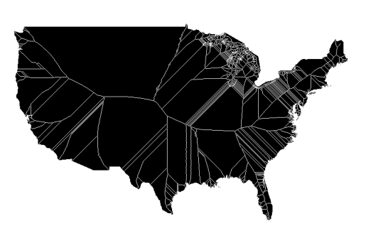

# Medial Axis Generator

## Description

This Python module generates the medial axis of a binary image and provides an option to save the result as an image. The medial axis is a skeleton-like representation of the input binary image, often used in image processing.

## Usage
Install necessary packages:
```bash
pip install matplotlib geopandas skicit-image
```

First convert the shapefile to a simple black and white image:
```bash
python convert_shp_to_bw_png.py <path_to_shapefile> <name_for_output_image> <dpi>
```

Then run the medial axis generator:
```bash
python find_medial_axis.py <path_to_image> <dpi>
```

The dpi parameter on both script is optional and defaults to 1000.

## Example
Here are the results of running the scripts on the shapefile in the data folder:
)


## License
This project is licensed under the terms of the [MIT](https://choosealicense.com/licenses/mit/) license.
